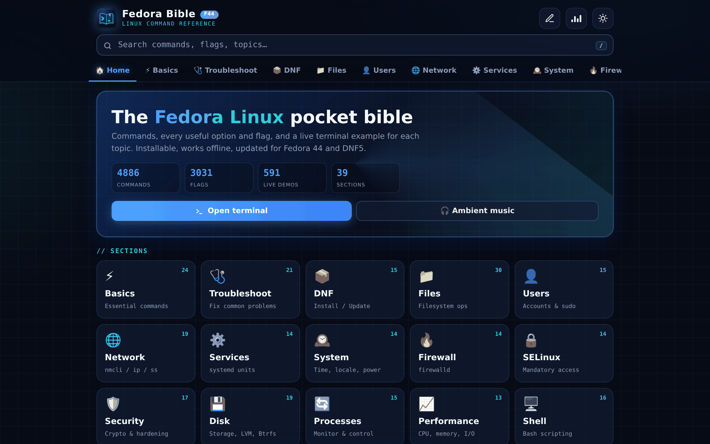
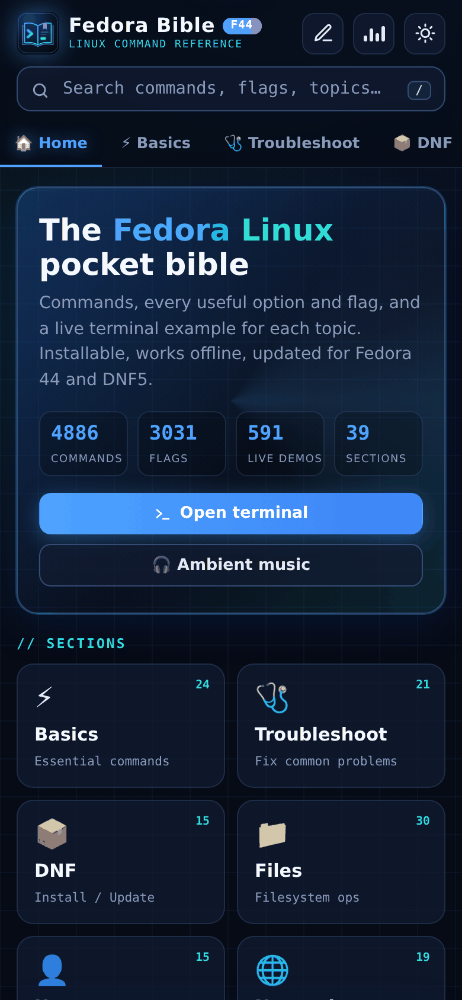
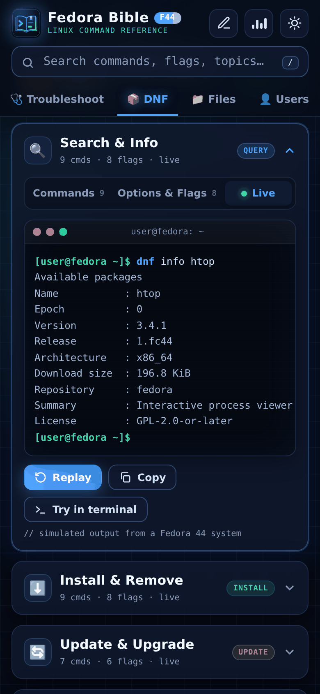
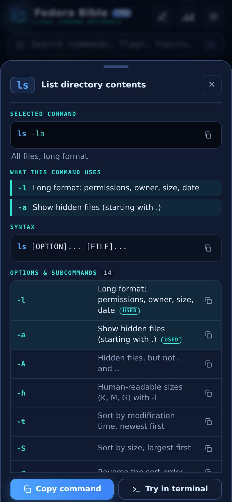
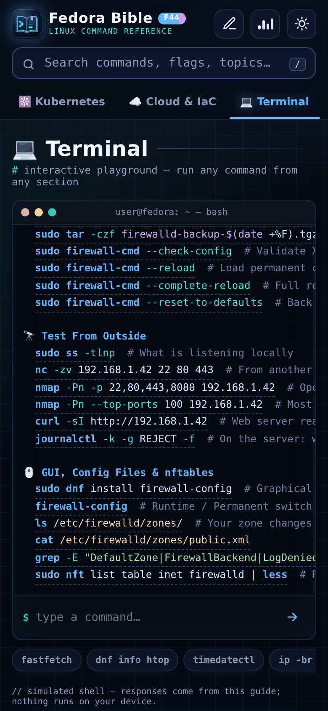
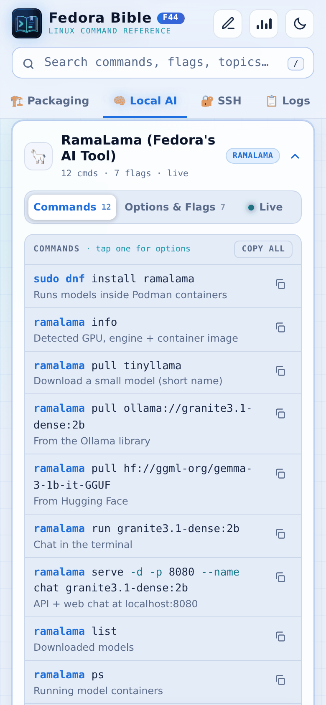
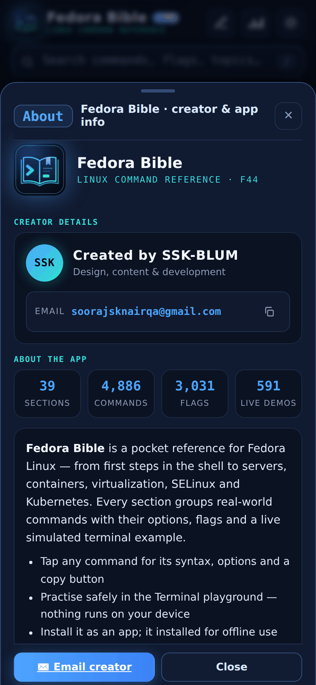

<div align="center">


# Fedora Bible

**The Fedora Linux pocket reference: commands, options and flags, with a live terminal example for every topic.**

Installable · Works offline · Mobile-first · Dark & light · Updated for Fedora 44 and DNF5

[**▶ Open the app**](https://YOUR-USERNAME.github.io/fedora-bible/) &nbsp;·&nbsp;
[Report a problem](../../issues/new?template=bug_report.md) &nbsp;·&nbsp;
[Suggest a command](../../issues/new?template=command_request.md)




</div>

---

## ✨ Features

- **39 sections, 594 topic cards, 4,886 commands**, from first steps in the shell to servers, containers, virtualization, SELinux, Kubernetes, local AI and gaming.
- **Options & flags** for every topic, explained in plain language.
- **Live examples**: each card has a simulated terminal that types the command and shows realistic Fedora 44 output.
- **Command pop-up**: tap any command to see its syntax, the options it uses, all other options with copy buttons, examples, and where else it appears in the guide.
- **Terminal playground**: type or tap *any* command from the guide. It also has `help`, `sections`, `commands <section>`, `search <text>`, `man <cmd>` and Tab completion.
- **Fast search** across commands, flags and topics (press <kbd>/</kbd>).
- **Installable PWA**: add it to your phone or desktop and it works **fully offline**.
- **Dark / light theme** and an optional ambient soundtrack.
- **No tracking, no accounts, no build step**: plain HTML, CSS and JavaScript.

## 📱 Screenshots

| Home | Live example | Command pop-up | Terminal |
|:---:|:---:|:---:|:---:|
|  |  |  |  |

| Light mode | About |
|:---:|:---:|
|  |  |

## 📚 Sections

Basics · Troubleshoot · DNF · Files · Users · Network · Services · System · Firewall · SELinux · Security · Disk · Processes · Performance · Shell · Git · Editors · Dev Tools · Packaging · Local AI · SSH · Logs · Boot · Install & Rescue · Desktop · Hardware · Android & Phone · Multimedia · Gaming · Backup · Distro UI · Flatpak · Containers · Virtualization · Web & DB · Servers · Ansible · Kubernetes · Cloud & IaC

## 🚀 Use it

**Online:** open **https://YOUR-USERNAME.github.io/fedora-bible/**, then choose *Install app* in the header or in your browser's menu.

**Locally:**

```bash
git clone https://github.com/YOUR-USERNAME/fedora-bible.git
cd fedora-bible
python3 -m http.server 8000
# open http://localhost:8000
```

A web server is needed for offline mode and installing. For a quick look without one, build a single file:

```bash
python3 tools/build_single.py      # → dist/fedora-bible.html (open it directly)
```

## 🗂️ Project structure

```
index.html            App shell, styles and layout
app.js                Rendering, search, pop-up, terminal playground, PWA logic
data.js               All content: sections → cards (commands, flags, examples, tips)
cmdref.js             Command reference for the pop-up (generated, do not edit)
sw.js                 Service worker (offline cache)
manifest.webmanifest  PWA manifest
icons/                App icons (SVG + PNG)
tools/
  cmdref/*.txt        Source of the command reference
  build_cmdref.py     Rebuild cmdref.js from tools/cmdref/*.txt
  build_single.py     Make a single self-contained HTML file
tests/smoke_test.py   Headless browser test of every card, pop-up and terminal command
docs/screenshots/     Images used in this README
```

## 🛠️ Development

**Add or change content.** Edit `data.js`. A card looks like this:

```js
{ title:'Search & Info', icon:'🔍', badge:'QUERY', color:'blue',   // blue · green · warn · red
  cmds:[ ['dnf info htop', 'Details about a package'] ],           // [command, short description]
  flags:[ ['--installed', 'Only installed packages'] ],
  example:{ cmd:'dnf info htop', out:`…realistic output…` },
  tip:'Optional tip.' /* also: warn, danger, code, table */ }
```

**Add a command to the pop-up reference.** Edit a file in `tools/cmdref/`, then rebuild:

```bash
python3 tools/build_cmdref.py
```

```
@mtr ~~ Traceroute and ping combined
$ mtr [OPTIONS] HOST
- -r -c N ~~ Report with N probes
> mtr -rwzc 50 1.1.1.1 ~~ Shareable report
```

**Release.** Bump `VERSION` in `sw.js` (e.g. `fb-v2.47.0`) so installed apps pick up the update.

**Test.**

```bash
pip install playwright && playwright install chromium
python3 tests/smoke_test.py
```

The same test runs automatically on every push and pull request (GitHub Actions).

## 🤝 Contributing

Corrections and new commands are very welcome. See [CONTRIBUTING.md](CONTRIBUTING.md).

## 👤 Author

Created by **SSK-BLUM** · ✉️ [soorajsknairqa@gmail.com](mailto:soorajsknairqa@gmail.com)

## 📄 License

[MIT](LICENSE) © 2026 SSK-BLUM

---

<sub>Simulated output: nothing in this app runs on your device. Fedora® is a trademark of Red Hat, Inc. Fedora Bible is an independent, unofficial project and is not affiliated with or endorsed by the Fedora Project or Red Hat.</sub>
